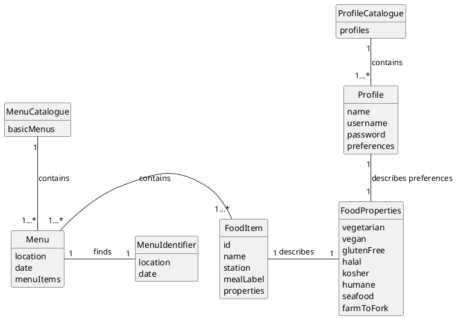
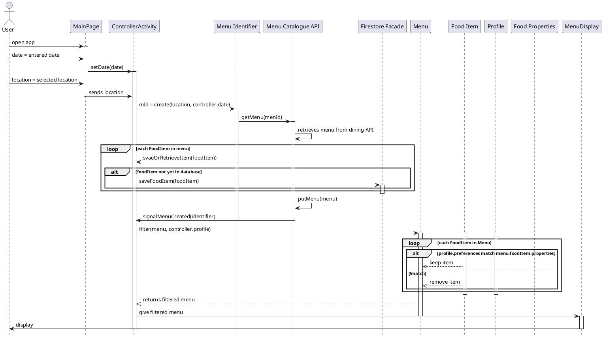
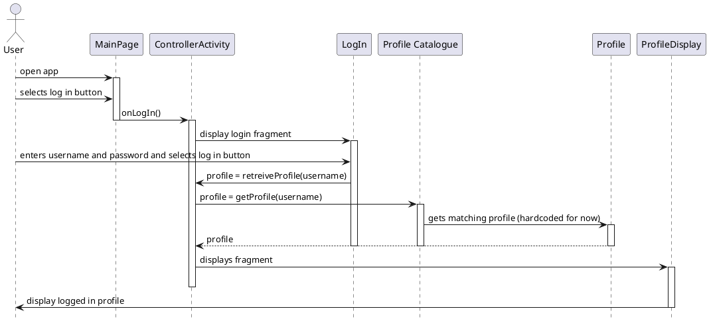
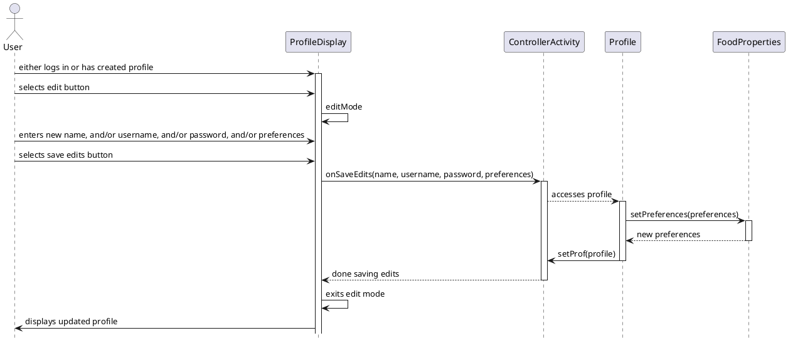
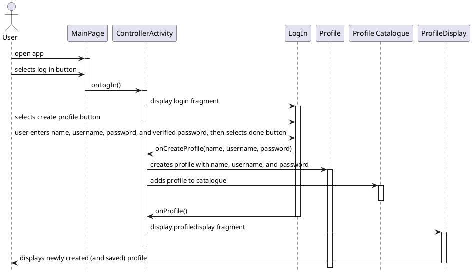
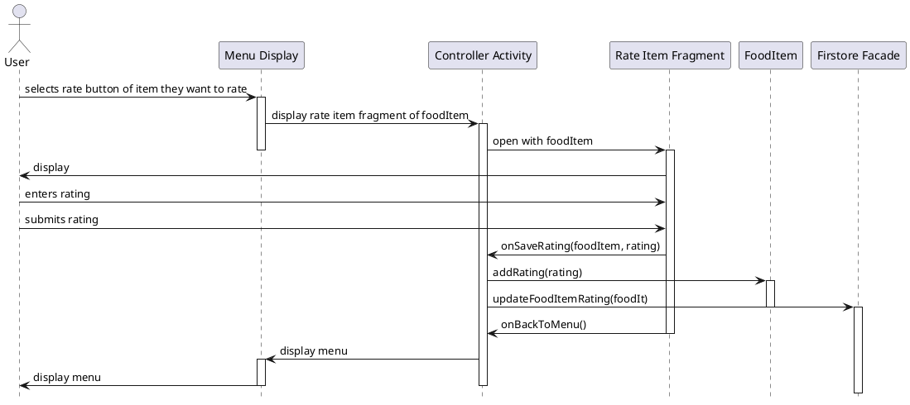

###Domain Model

```plantuml
@startuml
hide circle
hide empty methods
hide empty fields

'Classes

class MenuIdentifier{
location
date
}

class ProfileCatalogue{
profiles
}

class Profile{
name
username
password
preferences
}

class MenuCatalogue{
basicMenus
}

class Menu{
location
date
menuItems
}

class FoodProperties{
vegetarian
vegan
glutenFree
halal
kosher
humane
seafood
farmToFork    
}

class FoodItem{
id
name
station
mealLabel
properties
}

'Associations
MenuCatalogue "1" -down- "1...*" Menu: contains \t\t
Menu "1...*" -right- "1...*" FoodItem: \tcontains \t\t
ProfileCatalogue "1" -down- "1...*" Profile: contains \t\t 
FoodItem "1" -right- "1" FoodProperties:  describes \t
Profile "1" -down- "1" FoodProperties: describes preferences \t
MenuIdentifier "1" -left- "1" Menu: \t finds \t
 

@enduml
```

###Sequence Diagrams
#### Get Menu

```plantuml
@startuml
hide footbox

actor "User" as user
participant "MainPage" as MP
participant "ControllerActivity" as controller
participant "Menu Identifier" as menId
participant "Menu Catalogue API" as menCat
participant "Firestore Facade" as facade
participant "Menu" as menu
participant "Food Item" as foodIt
participant "Profile" as prof
participant "Food Properties" as foodProp
participant "MenuDisplay" as MD

user -> MP : open app
activate MP
user -> MP : date = entered date
MP -> controller : setDate(date)
activate controller
user -> MP : location = selected location
MP -> controller : sends location
deactivate MP
controller -> menId : mId = create(location, controller.date)
activate menId
menId -> menCat : getMenu(menId)
activate menCat
menCat -> menCat : retrieves menu from dining API
loop each FoodItem in menu
menCat -> controller : svaeOrRetrieveItem(foodItem)
alt foodItem not yet in database
controller -> facade : saveFoodItem(foodItem)
activate facade
end
end
deactivate facade
menCat -> menCat : putMenu(menu)
menCat -> controller : signalMenuCreated(identifier)
deactivate menId
deactivate menCat
controller -> menu : filter(menu, controller.profile)
activate menu
activate prof
loop each FoodItem in Menu
alt profile.preferences match menu.foodItem.properties
activate foodIt
foodIt -->> menu : keep item
else !match
foodIt -->> menu : remove item
end
end
deactivate foodIt
deactivate foodProp
deactivate prof
menu -->> controller : returns filtered menu
controller -> MD : give filtered menu
deactivate menu
activate MD
MD -> user : display 
deactivate MD
deactivate controller
@enduml
```

#### Log In

```plantuml
@startuml
hide footbox

actor "User" as user
participant "MainPage" as MP
participant "ControllerActivity" as controller
participant "LogIn" as LI
participant "Profile Catalogue" as profCat
participant "Profile" as prof
participant "ProfileDisplay" as PD


user -> MP : open app
activate MP
user -> MP : selects log in button
MP -> controller : onLogIn()
deactivate MP
activate controller
controller -> LI : display login fragment
activate LI
user -> LI : enters username and password and selects log in button
LI -> controller : profile = retreiveProfile(username)
controller -> profCat : profile = getProfile(username)
activate profCat
profCat -> prof : gets matching profile (hardcoded for now)
activate prof
prof --> controller : profile
deactivate prof
deactivate profCat
deactivate LI
controller -> PD : displays fragment
activate PD
deactivate controller
PD -> user : display logged in profile
deactivate PD
@enduml
```

#### Edit Profile/Set Preferences

```plantuml
@startuml
hide footbox

actor "User" as user
participant "ProfileDisplay" as PD
participant "ControllerActivity" as controller
participant "Profile" as prof
participant "FoodProperties" as fp


user -> PD : either logs in or has created profile
activate PD
user -> PD : selects edit button
PD -> PD : editMode
user -> PD : enters new name, and/or username, and/or password, and/or preferences
user -> PD : selects save edits button
PD -> controller : onSaveEdits(name, username, password, preferences)
activate controller
controller --> prof : accesses profile
activate prof
prof -> fp : setPreferences(preferences)
activate fp
fp --> prof : new preferences
deactivate fp
prof -> controller : setProf(profile)
deactivate prof
controller --> PD : done saving edits
deactivate controller
PD -> PD : exits edit mode
PD -> user : displays updated profile
@enduml
```

#### Create Profile

```plantuml
@startuml
hide footbox

actor "User" as user
participant "MainPage" as MP
participant "ControllerActivity" as controller
participant "LogIn" as LI
participant "Profile" as prof
participant "Profile Catalogue" as profCat
participant "ProfileDisplay" as PD


user -> MP : open app
activate MP
user -> MP : selects log in button
MP -> controller : onLogIn()
deactivate MP
activate controller
controller -> LI : display login fragment
activate LI
user -> LI : selects create profile button
user -> LI : user enters name, username, password, and verified password, then selects done button
LI -> controller : onCreateProfile(name, username, password)
controller -> prof : creates profile with name, username, and password
activate prof
controller -> profCat : adds profile to catalogue
activate profCat
deactivate profCat
LI -> controller : onProfile()
deactivate LI
controller -> PD : display profiledisplay fragment
activate PD
deactivate controller
PD -> user : displays newly created (and saved) profile
deactivate PD
@enduml
```

#### Rate Item

```plantuml
@startuml
hide footbox

actor "User" as user
participant "Menu Display" as MD
participant "Controller Activity" as controller
participant "Rate Item Fragment" as RI
participant "FoodItem" as foodIt
participant "Firstore Facade" as facade

user -> MD : selects rate button of item they want to rate
activate MD
MD -> controller : display rate item fragment of foodItem
activate controller
controller -> RI : open with foodItem
deactivate MD
activate RI
RI -> user : display
user -> RI : enters rating
user -> RI : submits rating
RI -> controller : onSaveRating(foodItem, rating)
controller -> foodIt : addRating(rating)
activate foodIt
controller -> facade : updateFoodItemRating(foodIt)
deactivate foodIt
activate facade
deactivate facade
RI -> controller : onBackToMenu()
deactivate RI
controller -> MD : display menu
activate MD
MD -> user : display menu
deactivate controller
deactivate MD
@enduml
```

###Class Diagram

```plantuml
@startuml
skinparam classAttributeIconSize 0

class MenuIdentifier{
    +location: String
    +date: String
    --
    +getLocation(): String
    +getDate(): String
    +equals(Object o): boolean
    +hashCode(): int
}

class Menu{
    location: String
    date: String
    mealLabels: Map<String, MealLabel>
    mealLabelNames: List<String>
    --
    +getDate(): String
    +getLocation(): String
    +getMenuItems(): LinkedList<FoodItem>
    +toString(): String
    +equals(Object o): boolean
}

class Profile{
    name: String
    username: String
    authKey: AuthKey
    preferences: FoodProperties
    {static} +NAME: String
    {static} +UNAME: String
    {static} +AKEY: String
    {static} +PREFS: String
    --
    +getName(): String
    +getUsername(): String
    +getAuthKey(): AuthKey
    +validatePassword(String password): boolean
    +getPreferences(): FoodProperties
}

class ProfileCatalogue{
    --
    +getProfile(String username): Profile
    +setProfiles(Map<String, Profile> profs): void
}

class MenuAccess{
    id: int
    cafe: String
    date: String
    station: String
    mealLabel: String
    menuItem: menuItem
    --
    +getId(): int
    +setID(int id): void
    +getCafe(): String
    +setCafe(String cafe): void
    +getDate(): String
    +setDate(String date): void
    +getStation(): String
    +setStation(String station): void
    +getMealLabel(): String
    +setMealLabel(String mealLabel): void
    +getMenuItem(): String
    +setMenuItem(String menuItem): void
    +toString(): String
}

interface IMenuCatalogue{
    +getMenu(MenuIdentifier identifier): Menu
    +getMenu(MenuIdentifier identifier, MenuCatalogueCallback callback): Menu
}

class MenuCatalogueApi implements IMenuCatalogue{
    {static} BASE_URL: String
    apiService: ApiInterface
    retrofit: Retrofit
    --
    +getMenu(MenuIdentifier identifier): Menu
    +getMenu(MenuIdentifier identifier, MenuCatalogueCallback callback): Menu
    +getBasicMenus(): HashMap<MenuIdentifier, Menu>
    +putMenu(Menu m): void
}

class FoodProperties{
    vegetarian: boolean
    vegan: boolean
    glutenFree: boolean
    halal: boolean
    kosher: boolean
    humane: boolean
    seafood: boolean
    farmToFork: boolean
    {static} KEY: String
    --
    +getPropVal(int i): boolean
    +changePropVal(int i): void
    +compareProperties(FoodProperties p): boolean
    +toString(): String
    {static} +getKey(): String
    +equals(Object o): boolean
    +getVegetarian(): boolean
    +getVegan(): boolean
    +getGlutenFree(): boolean
    +getHalal(): boolean
    +getKosher(): boolean
    +getHumane(): boolean
    +getSeafood(): boolean
    +getFarmToFork(): boolean
}

class FoodItem{
    name: String
    station: String
    mealLabel: String
    properties: FoodProperties
    sumRatings: int
    numRatings: int
    {static} +SUM_RATINGS: String
    {static} +NUM_RATINGS: String
    --
    +getName(): String
    +getProperties(): FoodProperties
    +toString(): String
    +getMealLabel(): String
    +getStation(): String
    +getSumRatings(): int
    +getNumRatings(): int
    +addRating(int rating): void
    +computeRating(): float
    +equals(Object o): boolean
}

class FoodItemCatalogue{
--
+getItem(String name): FoodItem
+addItem(FoodItem item): void
+setItems(Map<String, FoodItem> items): void
}

class MealLabel{
    label: String
    sations: Map<String, Station>
    stationNames: List<String>
    --
    +addStation(Station station): void
    +getStation(String station): Station
    +getStationNames(): List<String>
    +getLabel(): String
    +equals(Object o): boolean
}

class Station{
    station: String
    --
    +addItem(FoodItem item): void
    +getItems(): List<FoodItem>
    +getStation(): String
    +equals(Object o): boolean
}

class ControllerActivity{
    p: Profile
    mainView: IMainView
    menu: Menu
    menCat2: MenuCatalogueApi
    profCat: ProfileCatalogue
    itemCat: FoodItemCatalogue
    loggedIn: boolean
    date: String
    curPassword: String
    {static} +DEECE_STRING: String
    {static} +FOOD_TRUCK_STRING: String
    {static} +EXPRESS_STRING: String
    {static} +RETREAT_STRING: String
    {static} +CUR_MENU: String
    {static} +CUR_PROF: String
    {static} +CUR_MENCAT: String
    {static} +CUR_MENCAT2: String
    {static} +CUR_PROFCAT: String
    {static} +CUR_ITEMCAT: String
    {static} +LOGGED_IN: String
    {static} +CUR_DATE: String
    {static} +CUR_PASS: String
    persistenceFacade: IPersistenceFacade
    db: FirebaseFirestore
    --
    #onCreate(Bundle savedInstanceState): void
    #onSaveInstanceState(@NonNull Bundle outState): void
    +onSaveEdits(String name, String username, String password, FoodProperties fp): void
    +removeOldProfile(String username): void
    +usernameUnavailable(String username): boolean
    +isLoggedIn(): boolean
    +onExitProfile(): void
    +updateProfileDetails(IProfileDisplay profileDisplay): void
    +onDeece(): void
    +onFoodTruck: void
    +onRetreat(): void
    +onExpress(): void
    +onLogIn(): void
    +onProfile(): void
    +onLogOut(): void
    +onBackToMain(): void
    +onCreateProfile(String name, String username, String password): void
    +onOptions(): void
    +onMealLabelSelected(String mealLabel, IMenuDisplay menuDisplayView): void
    +onExitMenu(): void
    +getMenu(): Menu
    retrieveMenu(String location, String date): void
    +retrieveProfile(String username): void
    +getProfile(): Profile
    +setProfile(Profile p): void
    filter(Menu m, Profile p): void
    setPreference(Profile p, int i): void
    +getDate(): String
    +setDate(String date): void
    +signalMenuCreated(MenuIdentifier identifier): void
    +saveOrRetrieveItem(FoodItem item): FoodItem
    +onRateItem(FoodItem foodItem): void
    +onProfilesReceived(Map<String, Profile> profs): void
    +onFoodItemsReceived(Map<String, FoodItem> items): void
    +onBackToMenu(): void
    +onSaveRating(FoodItem foodItem, int rating): void
    +setCurPassword(String logInPass): void
}

class DiningAppFragFactory{
    controller: ControllerActivity
}

interface IMenuCatalogueCallback{
    +signalMenuCreated(): void
}

class MenuCatalogueCallback implements IMenuCatalogueCallback{
    +signalMenuCreated(): void
}

interface ApiInterface{
}

class AuthKey{
    salt: String
    key: String
    {static} SALT_LEN: int
    {static} KEY_LEN: int
    {static} NITERS: int
    --
    +getSalt(): String
    +getKey(): String
    +validatePassword(String password): boolean
    {static} generateSalt(): String
    {static} generateKey(String salt, String password): String
    +equals(Object o): boolean
}

class MenuItem{
    id: int
    name: String
    vegetarian: boolean
    vegan: boolean
    glutenFree: boolean
    halal: boolean
    kosher: boolean
    humane: boolean
    seafood: boolean
    farmToFork: boolean
    --
    +getId(): int
    +setId(int id): void
    +getName(): String
    +setName(String name): void
    +isVegetarian(): boolean
    +setVegetarian(boolean vegetarian): void
    +isVegan(): boolean
    +setVegan(boolean vegan): void
    +isGlutenFree(): boolean
    +setGlutenFree(boolean glutenFree): void
    +isHalal(): boolean
    +setHalal(boolean halal): void
    +isKosher(): boolean
    +setKosher(boolean kosher): void
    +isHumane(): boolean
    +setHumane(boolean humane): void
    +isSeafood(): boolean
    +setSeafood(boolean seafood): void
    +isFarmToFork(): boolean
    +setFarmToFork(boolean farmToFork): void
    +toString(): String
}

interface ILogInView{
    Listener: interface
    --
    passwordsMatch(): boolean
}

class LogInFragment implements ILogInView{
    binding: FragmentLogInBinding
    listener: Listener
    creating: boolean
    {static} +CREATING: String
    --
    +onCreate(@Nullable Bundle savedInstanceState): void
    +onCreateView(LayoutInflater inflater, ViewGroup container, Bundle savedInstanceState): View
    +onViewCreated(View view, Bundle savedInstanceState): void
    +passwordsMatch(): boolean
    +onSaveInstanceState(@NonNull Bundle outState): void
    +onViewStateRestored(@Nullable Bundle savedInstanceState): void
    +displayCreatingMode(): void
}

interface IMainPageView{
    Listener: interface
    --
    checkValidDate(String date): boolean
}

class MainPageFragment implements IMainPageView{
    binding: FragmentMainPageBinding
    listener: Listener
    mainDate: String
    {static} MAIN_DATE: String
    --
    {static} +makeArgsBundle(String mainDate): Bundle
    +onCreate(@Nullable Bundle savedInstanceState): void
    +onCreateView(@NonNull LayoutInflater inflater, ViewGroup container, Bundle savedInstanceState): View
    +onViewCreated(@NonNull View view, Bundle savedInstanceState): void
    +checkValidDate(String date): boolean
    +onSaveInstanceState(@NonNull Bundle outState): void
    +onViewStateRestored(@Nullable Bundle savedInstanceState): void
}

interface IMainView{
    +getRootView(): View
    +displayFragment(Fragment fragment): void
}

class MainViewFragment implements IMainView{
    activity: FragmentActivity
    binding: MainBinding
    --
    +getRootView(): View
    +displayFragment(Fragment fragment): void
}

interface IMenuDisplayView{
    Listener: interface
    --
    +updateDisplay(String mealLabel): void
}

class MenuDisplayFragment implements IMenuDisplayView{
    binding: FragmentMenuDisplayBinding
    listener: IMenuDisplay.listener
    m: Menu
    {static} MENU: String
    --
    {static} makeArgsBundle(Menu menu): Bundle
    +onCreate(@Nullable Bundle savedInstanceState): void
    +onCreateView(@NonNull LayoutInflater inflater, @Nullable ViewGroup container, @Nullable Bundle savedInstanceState): View
    +onViewCreated(@NonNull View view, @Nullable Bundle savedInstanceState): void
    makeTextView(LinearLayout l, String s): void
    +onSaveInstanceState(@NonNull Bundle outState): void
    +onViewStateRestored(@Nullable Bundle savedInstanceState): void
}

interface IProfileDisplayView{
    Listener: interface
    --
    +updateDisplay(String name, String username, String password, boolean vegetarian, boolean vegan, boolean glutenFree, boolean halal, boolean kosher, boolean humane, boolean seafood, boolean farmToFork): void
}

class ProfileDisplayFragment implements IProfileDisplayView{
    binding: FragmentProfileDisplayBinding
    listener: Listener
    passHidden: boolean
    editMode: boolean
    previousUsername: String
    {static} PASS_HIDDEN: String
    {static} EDIT_MODE: String
    {static} PREV_USERNAME: String
    --
    +onCreate(@Nullable Bundle savedInstanceState): void
    +onCreateView(LayoutInflater inflater, ViewGroup container, Bundle savedInstanceState): View
    setClickable(boolean bool): void
    +onViewCreated(View view, Bundle savedInstanceState): void
    +onSaveInstanceState(@NonNull Bundle outState): void
    +onViewStateRestored(@Nullable Bundle savedInstanceState): void
    +displayEditMode(): void
    +displayShownPass(): void
    +updateDisplay(String name, String username, String password, boolean vegetarian, boolean vegan, boolean glutenFree, boolean halal, boolean kosher, boolean humane, boolean seafood, boolean farmToFork): void
}

interface IRateItemView{
    Listener: interface
    --
}

class RateItemFragment implements IRateItemView{
    binding: FragmentRateItemBinding
    listener: IRateItemView.Listener
    foodItem: FoodItem
    {static} +FOOD_IT: String
    --
    {static} +makeArgsBundle(FoodItem foodItem): Bundle
    +onCreate(@Nullable Bundle savedInstanceState): void
    +onCreateView(@NonNull LayoutInflater inflater, @Nullable ViewGroup container, @Nullable Bundle savedInstanceState): View
    +onViewCreated(@NonNull View view, @Nullable Bundle savedInstanceState): void
    +onSaveInstanceState(@NonNull Bundle outState): void
    +onViewStateRestored(@Nullable Bundle savedInstanceState): void
}

interface IPersistenceFacade{
    ProfileListener: interface
    FoodItemListener: interface
    --
    saveProfile(Profile profile): void
    saveEditedProfile(Profile profile): void
    removeProfile(String username): void
    retrieveProfiles(ProfileListener listener): void
    saveFoodItem(FoodItem foodItem): void
    retrieveFoodItems(FoodItemListener listener): void
    pdateFoodItemRating(FoodItem foodItem): void
}

class FirestoreFacade implements IPersistenceFacade{
    db: FirebaseFirestore
    {static} PROFILES: String
    {static} FOOD_ITEMS: String
    --
    +saveProfile(Profile profile): void
    +saveEditedProfile(Profile profile): void
    +removeProfile(String username): void
    +retrieveProfiles(ProfileListener listener): void
    +saveFoodItem(FoodItem foodItem): void
    +retrieveFoodItems(FoodItemListener listener): void
    +updateFoodItemRating(FoodItem foodItem): void
}

'Associations
Menu-> "1\nlocation,date" MenuIdentifier: \t\t\t\t
Menu*- "(1...*)\nmenuItems\n{LinkedList}" FoodItem: \t\t\t\t
ProfileCatalogue*- "(1...*)\nprofiles\n{HashMap}" Profile: \t\t\t\t
ControllerActivity..> Menu
ControllerActivity..> Profile
MenuCatalogueApi..> MenuIdentifier
FoodItemCatalogue*- "(1...*)\nitems\n{Map}" FoodItem: \t\t
FoodItem..> Profile
FoodItem*- "1\nproperties\n" FoodProperties: \t\t\t
ControllerActivity..> LogInFragment
ControllerActivity..> MainPageFragment
ControllerActivity..> MainView
ControllerActivity..> MenuDisplayFragment
ControllerActivity..> ProfileDisplayFragment
ControllerActivity--> RateItemFragment
FoodProperties..>Profile
MenuCatalogueApi*- "(1...*)\nbasicMenus\n{HashMap}" Menu: \t\t
Station*- "(1...*)\nitems\n{List}" FoodItems: \t\t

@enduml

```