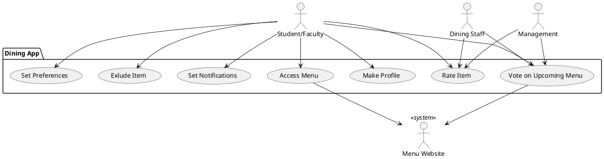

# Vision Document

### Introduction:

The goal of our dining app is to provide Vassar students and faculty on the meal plan with personalized and filtered menus for all of the Vassar dining locations, with reviews written by other diners and notifications for items of interest.

### Business Case:

Our dining app provides Vassar users with useful information the current dining website does not:
1. It allows users to set preferences, giving them personalized menus for each location
2. It includes public reviews for items written by other users, facilitating users’ decision making
3. It allows users to have an input on food items for upcoming weeks

### Key Features:
- App users can access current menu
- Users can create a profile
- Users can save dietary preference menu filters to their profiles
- Users can mark menu items as favorites (or set them to never be displayed again)
- Users can leave a star (and optionally a comment) review for a menu item
- Users can vote on menu options for upcoming weeks

### Stakeholder Goals:
- **Students/Faculty**: access current menus, access personalized menus based on dietary restrictions and preferences, save favorite meals, provide feedback on meals to influence future menus
- **Vassar Dining**: display current menus, receive feedback from students/faculty in order to adjust menus, limit food waste and prevent popular items from running out too quickly. Make dining more efficient and limit crowds in dining halls.
- **Bon Appetit**: better communication with vassar dining by understanding preferences of those on the meal plan

### System Context Diagram
